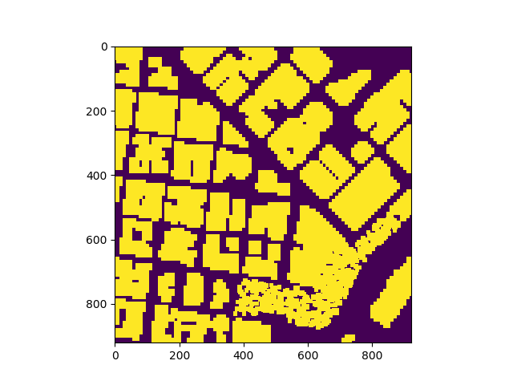

## Project: 3D Motion Planning

---

Map of the given city


### Explain the Starter Code


#### 1. Explain the functionality of what's provided in `motion_planning.py` and `planning_utils.py` in comparison to `backyard_flyer_solution.py`

In the `motion_planning.py` script the main class for motion planning is implemented.
This scripts contain a basic planning implementation that includes three callback functions (local position, velocity and state), six transition functions (arming, takeoff, waypoint, landing, disarming and manual) as well as a path planning function.

There are seven states all together:
Manual, Arming, Takeoff, Waypoint, Landing, Disarming and Planning, whereas the Planning state is new in the `motion_planning.py` script compared to the backyard_flyer. In the backyard_flyer solution we can create the waypoints (in this case the four box waypoints) on the fly, when we have already taken off, because there are only very few waypoints and no searching/planning has to be done. In the motion_planning implementation the path is created/planned as soon as we armed the drone. We then go into the Planning state, in which the takeoff_transition is called. During the takeoff we search for the best path from our current position to the specified goal position. When having taken off, the created waypoints get popped from the list and are being followed by the drone.

As soon as all waypoints are popped and the list is empty (plus the velocity is smaller than a given threshold) the drone lands and is shutting down (disarming and going to manual mode). This last part is the same as it is in the backyard flyer implementation.

The most interesting part of the motion planner script is the plan_path() function. In the starter version of this function the grid creation, definition of start and goal coordinates, the call to A* algorithm and finally the assignment of the waypoints to self.waypoints is carried out.


In the `planning_utils.py` file some necessary utility functions are implemented i.e. the A* algorithm implementation, the grid creation, etc.

### Implementing Your Path Planning Algorithm

#### 1. Set your global home position

Setting the global home position of the drone includes opening the file 'colliders.csv', reading the first line and extracting and converting the longitude and latitude to float values.

This values can then be set as the drones global home position. See code below.

```python
with open('colliders.csv') as f:
    origin_pos_data = f.readline().split(',')
lat0 = float(origin_pos_data[0].strip().split(' ')[1])
lon0 = float(origin_pos_data[1].strip().split(' ')[1])
self.set_home_position(lon0, lat0, 0)
```

#### 2. Set your current local position

Determining the current local position from the global position can simply be achieved with the global_to_local() helper function

```python
local_position = global_to_local(global_position, (lon0, lat0, 0))
```
where lon0 and lat0 are the two float values from the colliders file, that we set as our home position. global_position is the global position of our drone, which in our case in the beginning is identical to the home position.


#### 3. Set grid start position from local position

The grid start position is set by taking the local position of the drone minus the offset plus the actual goal, that can be set via the class init method.

```python
grid_goal = (int(local_position[0]-north_offset + local_goal[0]), int(local_position[1]-east_offset + local_goal[1]))
```


#### 4. Set grid goal position from geodetic coords
This step is already done in the on-liner above in 3. Set grid start position from local position

#### 5. Modify A* to include diagonal motion (or replace A* altogether)

The following heuristic function is used for accomplishing the cost for diagonal motion:
```python
def heuristic(position, goal_position):
    return np.linalg.norm(np.array(position) - np.array(goal_position))
```

#### 6. Cull waypoints

For this step a simple collinearity step is used for pruning the path from unnecessary waypoints:
```python
def collinear(a, b, c):
    m = np.concatenate((a, b, c), 0)
    det = np.linalg.det(m)
    return abs(det) < 1e-6
```


### Execute the flight
#### 1. Does it work?
It works!

### Double check that you've met specifications for each of the [rubric](https://review.udacity.com/#!/rubrics/1534/view) points.

# Extra Challenges: Real World Planning

For an extra challenge, consider implementing some of the techniques described in the "Real World Planning" lesson. You could try implementing a vehicle model to take dynamic constraints into account, or implement a replanning method to invoke if you get off course or encounter unexpected obstacles.
